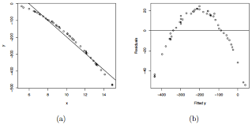
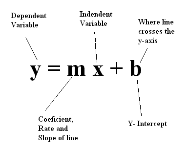
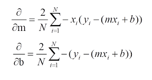
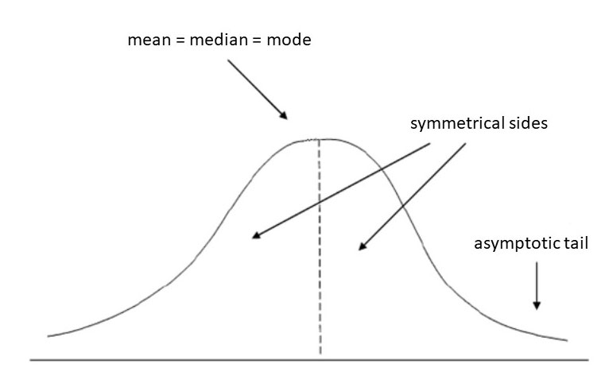
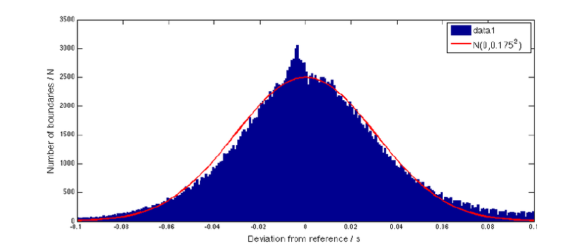
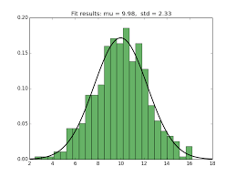
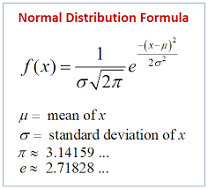

 
<i>Glad to see you all</i>

You all had gone through below listed things as far as i am correct in 2nd Workshop
- Linear Regression
- Logistic Regression
- Gradient Descent(Optimization)
- And So and So For.................... 

**Firstly Let's progress our Trip :train: of Regression and Optimization from Workshop**

## Linear Regression

I am not going to give definitions but want to clarify some base concepts which will help you later in solving assignment.

**Data Distribution**

It is well clear that the regression assumes a linear variation of data. For Ex-

 

In the above image Fig-(a) showing a good fit with linear Regression as the data distribution is almost linear, on the other hand in Fig-(b) showing a non linear data distribution so linear regression cannot perform well. These non linear data requires fitting complex models which you will learn later. 
 

**Equation**

Although this regression applicable for any number of dimensions, here i am writing it for 2D space which involves finding two optimal(best) parameters

 

Here `m` and `b` are the two parameters which need to be determined for finding the optimal line for given data.

**Loss and Update Eqn**

Most important is to calculate loss( which is generally Mean Squared Error(MSE) in case of Regression) and update eqn for Gradient descent.

 
Mean Squared error Loss(Left) and Update eqn(Right) 

**Implementation**

[Resource for implementing linear regression from scratch](https://towardsdatascience.com/coding-linear-regression-from-scratch-c42ec079902) 

<h1 align="center">Your Task</h1>

Although, I already told that you will learn about fitting complex model on non linear data later, here in this Assignment you will solve a trivial fitting problem on a famous(one of the most important eqn in math) non linear data distribution known as Gaussian/Normal Distribution which looks like as

 
Ideal Curve(Left) and Noisy Real Data(Right) 

In Real Cases the data is not ideal as it contain small erros accumulated from different sources but we can approximate any normal data to it's nearest optimal normal curve like shown below.

 

So those who not know about Gaussian/Normal Distribution, below are the resource that we followed at our time to understand it. Kindly go through it one by one. 

### Importance of Normal distribution
* [What is normal distribution and why it is important](https://medium.com/analytics-vidhya/the-normal-distribution-for-data-scientists-6de041a01cb9#:~:text=The%20normal%20distribution%20is%20a,in%20the%20data%20science%20curriculum.)
* [Blog 2](https://towardsdatascience.com/the-powers-of-normal-distribution-4cbb06e4a955)
* [Why Data scienctists love Gaussian](https://towardsdatascience.com/why-data-scientists-love-gaussian-6e7a7b726859)

So, If you went through above links you will encounter an eqn something like

 
it contains two parameters mu and sigma

Hence, just like the 2D line `y=mx+b` which contains two parameters `m` and `b` here the two parameters are `mu` and `sigma`. Your Task is find these two optimal parameters for the noisy data given. 

How To Start:-

- Create a Copy of this [**JUPYTER NOTEBOOK**](https://colab.research.google.com/drive/1EoRNvI1FDWaoaiipwEpp8uWhxV3Nqs_G?usp=sharing).
- Run the first cell which will tell you the optimal `mu` and `sigma` for the data. These values help you later to verify your code is correct or not.
- Now taking intutition from above implemetation of linear regression.
- Use Same MSE loss.
- Calculate Loss derivative w.r.t `mu` and `sigma` to find update eqn to perform gradient descent.
- Run Gradient Descent Until Optimization.(And as a sanity check, ensure that the parameter values you get after convergence is close to the optimal ones from first cell.)

### To Submit-

Create a Zip Consisting
 - image of output from first cell
 - Loss/Cost Curve(Take reference from above linear regression implemtation).
 - Notebok Containing your final code. In the last cell of notebook, comment the number of iterations your code took for convergence, the learning rate you used and the `mu` and `sigma` your code output.

**Deadline will be informed later, just work patiently and enjoy this task, we will provide enough time so don't worry about time.** 

