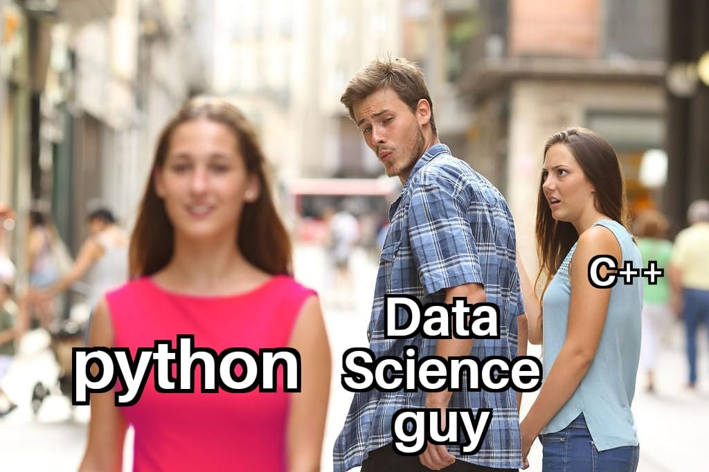

<h1 align="center">Exclusive Content</h1>

We know that those who encounter data science terminology for the first time technically, will face a situation of overwhelming stuffs. It happened with us as well. 
So, we the Caasandra Coordinators will try to treat your wounds :slightly_smiling_face:. We will start in the same process in wich you encounter different terminologies when anyone starts their journey in data science. 

**This is an actively updating file so check it out regularly, 
we will inform after updation.**

**Some useful sites and blogs to follow**

Blogs

- [MachineLearningMastery](https://machinelearningmastery.com/)  ✨
- [towardsDataScience](https://towardsdatascience.com/) ✨
- [kdnuggets](https://www.kdnuggets.com/)
- [AnalyticsVidhya](https://www.analyticsvidhya.com/blog/)

Podcasts

- [Learning Machines 101](http://www.learningmachines101.com/)
- [Talking Machines](http://www.thetalkingmachines.com/)
- [This Week in Machine Learning and AI](https://twimlai.com/)
- [Linear Digressions](http://lineardigressions.com/)

### 1. Data Science Languages

Most of us heard that C++, C are very fast languages and used in software developments, In data science speed matters but testing new algorithms fastly matters most, and python and R libraries have an extra edge over C++ due to it's simplicity for fast prototyping hence, 

we will stick with python for testing new algorithms that we need to apply in data science field or specially in this event.

For Python Basics [Awesome lecture series by Sentdex](https://www.youtube.com/playlist?list=PLQVvvaa0QuDe8XSftW-RAxdo6OmaeL85M)(**first few videos are sufficient for grasping python, later things u will learn while doing**)

